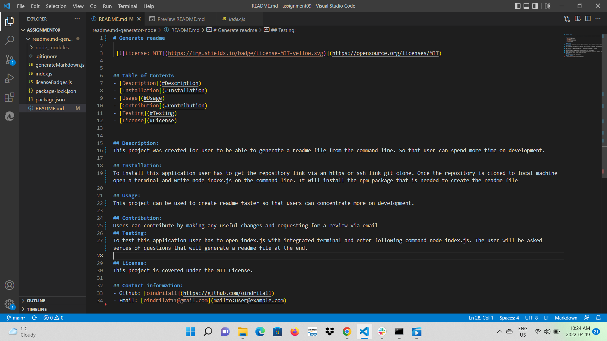
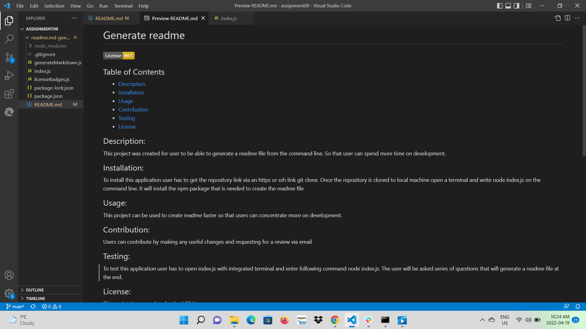

# Generate readme

 
 

## Table of Contents
- [Description](#Description)
- [Installation](#Installation)
- [Usage](#Usage)
- [Contribution](#Contribution)
- [Testing](#Testing)
- [License](#License)

## Description:
This project was created for user to be able to generate a readme file from the command line. So that user can spend more time on development.

## Installation:
To install this application user has to get the repository link via an https or ssh link 
git clone 
Once the repository is cloned to local machine open a terminal and on the command line write 
npm install  
It will install the npm package that is needed to create the readme file 

## Usage:
This project can be used to create readme faster so that users can concentrate more on development.
Here is the link to a video that shows how to use this application https://vimeo.com/700876725

## Contribution:
Users can contribute by making any useful changes and requesting for a review via email
## Testing:
To test this application user has to open index.js with integrated terminal and enter following command node index.js. The user will be asked series of questions that will generate a readme file at the end.

These screenshots provided below will help user to understand it better. 

## License:
This project is covered under the MIT License.

## Contact information:
- Github: [oindrila11](https://github.com/oindrila11)
- Email: [oindrilat11@gmail.com](mailto:user@example.com) 
